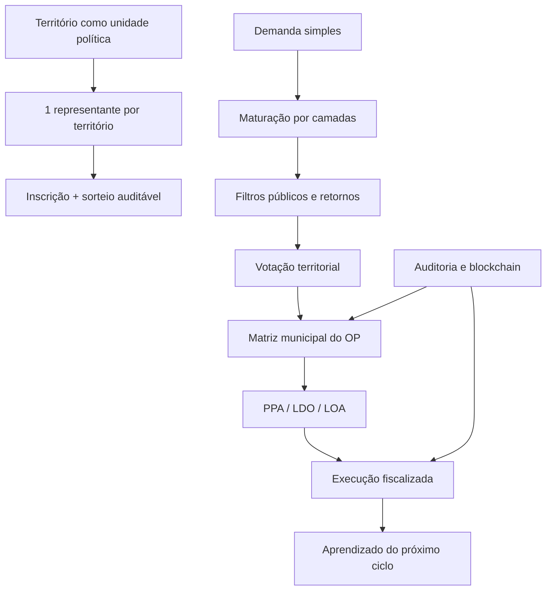

# Código Público — Resumo Teórico Operacional

O Código Público é uma infraestrutura pública de Orçamento Participativo municipal. A teoria política entra como regra operacional: território, sorteio, contestabilidade, auditoria, deliberação, orçamento e execução.



## 1. Território

O território é a unidade política base. Cada bairro, comunidade ou distrito reconhecido tem 1 representante territorial.

Essa decisão substitui proporcionalidade populacional e cotas iniciais por uma regra simples:

```txt
1 território = 1 representação
```

## 2. Sorteio

O Maintainer Territorial é escolhido por inscrição e sorteio auditável entre cidadãos vinculados ao território.

A legitimidade vem de duas fontes:

- **origem**: sorteio reduz captura eleitoral e concentração de poder local;
- **exercício**: mandato temporário, justificativas, recall, recurso e auditoria.

## 3. Demanda simples

O cidadão começa pelo problema, não pela linguagem técnica.

```txt
Falta médico no PSF.
Estrada rural sem manutenção.
Iluminação pública quebrada.
Transporte escolar irregular.
```

A demanda ganha maturidade por apoio comunitário, agrupamento, forks, complementações e filtros públicos.

## 4. Filtros com retorno

Filtro não é porta fechada. É etapa de maturidade.

```txt
faltou informação       → volta para maturação
duplicada               → agrupa
solução alternativa     → vira fork
custo alto              → faseia ou vai para ciclo plurianual
fora da competência     → reivindicação externa
ilegal/inconstitucional → bloqueio fundamentado e reformulação quando possível
```

## 5. Legislativo como Maintainer Geral

O Legislativo municipal abre o ciclo, define calendário, recebe a matriz do OP e conduz a institucionalização no PPA, LDO e LOA.

Ele pode filtrar impedimentos formais, mas não pode ser veto invisível. Toda negativa precisa ter fundamento, audit log e caminho de retorno.

## 6. Code is law

O sistema separa:

```txt
Kernel comum
  regras mínimas: território com voz, sorteio, mandato temporário, privacidade, auditoria, retorno da esteira

Regimento local
  parâmetros: calendário, mandato, quórum, envelope, índice de carência, prazos de execução
```

## 7. Execução e aprendizado

O OP não termina na votação. Cada item aprovado vira execução fiscalizável.

Atraso, paralisação, cancelamento ou frustração devem entrar na memória do território e influenciar o próximo ciclo.

## 8. Blockchain

Blockchain serve para prova de integridade, não para guardar pessoa.

Pode ancorar:

- hash da lista elegível do sorteio;
- hash do resultado;
- matriz consolidada;
- release do ciclo;
- eventos relevantes de execução.

Nunca deve conter CPF, endereço, documento, voto individual, denúncia identificável ou dado sensível.
