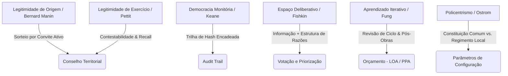

# Código Público — Síntese Teórica Operacional

Este documento mapeia como os referenciais teóricos da democracia moderna são convertidos em engenharia de software e regras operacionais dentro do **Código Público**. Ele serve como guia rápido de design constitucional-tecnológico do projeto.

---

## 1. O Filtro de Legitimidade de Origem e Exercício
*   **Fundamento (Bernard Manin & Philip Pettit):** A eleição carrega um viés aristocrático estrutural que favorece elites. O sorteio (sortição) é o mecanismo igualitário por definição. A legitimidade da democracia se divide em *origem* (como ascende) e *exercício* (como atua).
*   **Operação no Código:**
    *   **Mandatos com Rotação:** O mandato de maintainers territoriais e conselheiros é estritamente limitado no tempo (`term_end` em [maintainer_policy.go](file:///C:/Users/dionatan.resende/Downloads/codigo-publico/backend/internal/territorial/maintainer_policy.go#L20)).
    *   **Contestabilidade Ativa:** Qualquer decisão do mantenedor territorial (como recusar um vínculo de cidadão) exige justificativa e é passível de recurso em tempo real à instância recursal geral (Maintainer Geral) e de recall pela comunidade.
    *   **Decisão Pura Isolada:** A máquina de estados de transição de propostas normativas em [pr_statemachine.go](file:///C:/Users/dionatan.resende/Downloads/codigo-publico/backend/internal/public/pr_statemachine.go) garante que nenhuma transição seja silenciosa ou arbitrária.

## 2. A Democracia Monitória e Escudo de Imutabilidade
*   **Fundamento (John Keane):** O poder legítimo é monitorado e vigiado continuamente por múltiplos escrutínios independentes. Isso força nos governantes uma atitude de responsabilidade (*humility*).
*   **Operação no Código:**
    *   **Trilha de Auditoria Dupla:** Implementada no banco ([010_audit_hash_chain.sql](file:///C:/Users/dionatan.resende/Downloads/codigo-publico/backend/migrations/010_audit_hash_chain.sql)) e estruturada em [audit.go](file:///C:/Users/dionatan.resende/Downloads/codigo-publico/backend/internal/audit/audit.go). Cada ação governamental grava um evento criptograficamente encadeado ao anterior.
    *   **Redundância de Âncoras:** A cabeça dos hashes é publicada automaticamente no Diário Oficial e em blockchain pública/imprensa (através do contrato de [anchor.go](file:///C:/Users/dionatan.resende/Downloads/codigo-publico/backend/internal/blockchain/anchor.go)), impossibilitando o administrador local de "reescrever a história".

## 3. Deliberação Qualificada vs. Agregação Cega de Votos
*   **Fundamento (Habermas, Fishkin & Chwalisz):** Agregar votos sem debate prévio apenas consolida preconceitos e letramentos desiguais. A deliberação deve conter informação qualificada, estrutura racional de argumentos e tempo suficiente de maturação.
*   **Operação no Código:**
    *   **Estrutura de Razões:** O sistema de debate de issues e propostas (especificado em [contracts.go](file:///C:/Users/dionatan.resende/Downloads/codigo-publico/backend/internal/public/contracts.go)) categoriza contribuições em argumentos estruturados (prós, contras e trade-offs) em vez de caixas de comentários abertas.
    *   **Assessoria Técnica Simplificada:** A interface (camada de UI cidadã) expõe laudos de viabilidade orçamentária e jurídica elaborados pelos técnicos, garantindo que o cidadão decida munido de informações reais.
    *   **Janelas Temporais Mínimas:** Bloqueio no Go que impede o encerramento reativo ou imediato de consultas populares antes de um prazo mínimo de deliberação coletiva.

## 4. Política da Presença e Inclusão Periférica
*   **Fundamento (Iris Marion Young & Anne Phillips):** Sorteios puramente voluntários (*opt-in*) reproduzem exclusões sistêmicas de minorias vulneráveis. A presença efetiva exige mecanismos proativos de compensação e recrutamento.
*   **Operação no Código:**
    *   **Sorteio por Convite Ativo:** Em vez de sorteio em listas de inscrição, a `policy` recruta de forma aleatória em toda a base municipal qualificada, enviando notificações diretas de convocação.
    *   **Compensação Constitucional:** O regimento prevê ajuda de custo financeira ou abono de trabalho regulados no sistema orçamentário para viabilizar as horas de serviço público dos sorteados vulneráveis.

## 5. Devolução Real de Poder e Aprendizado Iterativo
*   **Fundamento (Archon Fung & Dani Rodrik):** Participação digital sem decisão vinculante degenera rápido. O sistema de governança local precisa de um canal explícito para aprender com seus próprios erros e falhas operacionais anteriores.
*   **Operação no Código:**
    *   **Revisão de Ciclo:** Ao encerramento de cada orçamento anual, o sistema calcula o índice de entrega física das obras aprovadas em releases passadas.
    *   **Retroalimentação Algorítmica:** O atraso sistemático na execução de obras de um determinado território altera os pesos na fórmula redistributiva ou penaliza orçamentos discricionários do executivo no ciclo subsequente, forçando a eficiência institucional.

## 6. O Modelo Ostromiano de Policentrismo
*   **Fundamento (Elinor Ostrom):** Comunidades locais gerem recursos comuns de forma otimizada quando detêm autonomia para definir suas próprias regras (policentrismo).
*   **Operação no Código:**
    *   **Divisão de Poderes Constitucionais:**
        *   *Constituição Comum:* O código-fonte comum em Go define o núcleo estrutural intocável (sorteio, recall, imutabilidade, privacidade por HMAC/Bcrypt).
        *   *Regimento Local:* Cada instância municipal parametriza o sistema em tabelas específicas de metadados, definindo seus próprios quóruns de recall, tempo de mandato, envelopes financeiros e pesos da fórmula de carência distributiva.
